# THIS IS THE GitHub repository for continued devlopment, for the original repository see: [https://code.jgi.doe.gov/spacersdb/spacer_matching_bench](https://code.jgi.doe.gov/spacersdb/spacer_matching_bench)


# Benchmarking protospacer identification tools
Scripts, code, and data for the manuscript: "Tool Choice drastically Impacts CRISPR Spacer-Protospacer Detection"   
Raw data files available in zenodo: [https://zenodo.org/doi/10.5281/zenodo.15171878](https://zenodo.org/doi/10.5281/zenodo.15171878).  
This benchmark is a companion project to the [SpacerDB](https://spacers.jgi.doe.gov/) and the [SpacerExtractor](https://code.jgi.doe.gov/SRoux/spacerextractor) tools.  


## Overview
CLI Python script for simulating spacer insertions into contigs and benchmarking sequence aligners. Generates synthetic data with known ground truth and evaluates aligner performance metrics (precision, recall, F1) and runtime. Note that for proper in-depth analysis, the jupyter notebooks are preferable (less heuristics, more detailed, and runs additional tests to verify the different tool reported alignments (so more consistent approach)).

## How should I analyse my own samples? (tl;dr)
For analyzing your own samples, we recommend using [SpacerExtractor](https://code.jgi.doe.gov/SRoux/spacerextractor#extra-functions---map-spacers-to-potential-targets-at-scale) rather than this benchmarking repository. SpacerExtractor is designed for practical analysis, using only bowtie1 for alignments, and includes features like:
- Wrapping bowtie1 commands for indexing and alignment of contigs and spacers.
- Extraction of flanking sequences (10 bases up/downstream of matches) for PAM analysis
- Built-in SAM file parsing (and filtering) and alignment visualization.

### Still, when should I use code from this benchmarking repository for my own (non-benchmarking) analysis?
(Apart from running benchmarks, of course), You might find the code useful for if you are interested in:
1. Utilizing multiple search tools,
2. Double-checking the reported alignments
3. Matches with >3 mismatches, or with gaps (bowtie1, wrapped by SpacerExtractor, is limited to 3).
4. The performance/resource usage of a tool (for example, you are optimizing a tool for a specific range of datasets size and parameter ranges).

### Key Features
- Simulates contigs and spacers at given frequency and specifications.
- Hyperfine integration for runtime benchmarking.
- Configurable parameters: contig count (default: 1500), spacer count (default: 50), mismatches (default: 0-5), reverse complements (default: 0.5), length of contigs (default: 1000-32000bp), length of spacers (default: 20-60bp), number of threads to use (default: 1), and number of hyperfine warmups and max runs (default: 0 and 5).
- Parallel processing support (most simulations is done in the rust code (see [rust_simulator](https://code.jgi.doe.gov/spacersdb/spacer_matching_bench/-/tree/main/rust_simulator?ref_type=heads/)).
- Modular tool configuration system.

## Aligners and search-engines tested so far 
For a complete list, see the [tool_versions.txt](tool_configs/tool_versions.txt) and the json files in the `tool_configs` folder. Note, not all of these were tested on the real dataset, some are later additions or variants of the tools tested.
1. [Bowtie1](https://github.com/BenLangmead/bowtie)
2. [Bowtie2](https://github.com/BenLangmead/bowtie2)
3. [Minimap2](https://github.com/lh3/minimap2)
4. [BBMap-skimmer](https://sourceforge.net/projects/bbmap/)
5. [StrobeAlign](https://github.com/ksahlin/StrobeAlign)
6. [BLASTN-short](https://blast.ncbi.nlm.nih.gov/doc/blast-help/downloadblastdata.html)
7. [MMseqs2](https://github.com/soedinglab/MMseqs2)
8. [Naive impl. in Rust](https://github.com/apcamargo/spacer-containment)
9. [nucmer](https://github.com/mummer4/mummer)

## Installation
The code is wrapped as a python package with a rust module. These require some dependencies. I recomend using [pixi](https://pixi.sh/) to manage the default environment used for the simulation, but you can use mamba or conda to install to create a basic environment too (see the [`benchy_env.sh`](./src/bench/utils/benchy_env.sh) script).
The basic/default environment includes Python <=3.9, polars, hyperfine, the simplistic implementation of substring containment in Rust ([spacer-containment](https://github.com/apcamargo/spacer-containment)), and other general dependencies used in the notebooks (like matplotlib, seaborn, altair, pyfastx, needletail, etc). IIRC all used tools should be listed in the [references bibtex](draft/main/references.bib).
After the base environment is created, you could use the `tool_env_maker.sh` script to create micromamba environments for the aligner/search-engines tested in the manuscript. The idea is to avoid conflicts between the different versions of the tools, and have one environment per tool.  
Note - all these different environments can take up a lot of disk space.    
Note2 - the `tool_env_maker.sh` script is not mandatory - you can create the environments manually, but keep in mind that the environment names are used in the tool configs json files (e.g. `bowtie1_env`), so you might need to change them in the json files.  
Note3 - This is designed (tested) to run on a Linux system with a bash shell.  
Note4 - the full `simulated_data` and `raw_outputs` directories are not uploaded to gitlab to conserve space. A static copy is available in the [zenodo](https://zenodo.org/record/15171878) deposit.   

tl;dr - with pixi: 
```bash
# clone the repo
git clone https://code.jgi.doe.gov/spacersdb/spacer_matching_bench.git
cd spacer_matching_bench
# get pixi if you don't have it
if ! command -v pixi &> /dev/null; then
    # linux and mac
    curl -fsSL https://pixi.sh/install.sh | sh 
    # windows
  # powershell -ExecutionPolicy ByPass -c "irm -useb https://pixi.sh/install.ps1 | iex"
fi
# Create the default enviroment
pixi install 
# install the default environment and the "bench" python package (plus the rust simulation module)
pixi run build-all
# create the tool specific mamba envs
bash ./src/bench/utils/tool_env_maker.sh
```

If you don't want to use pixi, you can use `benchy_env.sh` to create a base environment with the general dependencies:
```bash
bash ./src/bench/utils/benchy_env.sh
# create the tool specific mamba envs
bash ./src/bench/utils/tool_env_maker.sh
```

## Usage

After installation, you can run the benchmarking tool using either:

```bash
spacer_bencher [command] [options]
```

or directly via Python:

```bash
python -m bench.bench [command] [options]
```

### Available Commands:

#### `full_run` - Complete benchmarking pipeline (original functionality)
```bash
spacer_bencher full_run --contig_length_range 1000 32000 --spacer_length_range 20 60 --n_mismatch_range 0 5 --sample_size_contigs 1500 --sample_size_spacers 50 --insertion_range 1 5 --threads 1 --prop_rc 0.5
```

#### `simulate` - Generate simulated sequences only
```bash
spacer_bencher simulate --sample_size_contigs 1500 --sample_size_spacers 50 --output_dir results/my_simulation
```

#### `generate_scripts` - Generate tool execution scripts
```bash
spacer_bencher generate_scripts --input_dir results/my_simulation --threads 1 --skip_tools "vsearch"
```

#### `run_tools` - Execute tools on simulated data
```bash
spacer_bencher run_tools --input_dir results/my_simulation --threads 1 --max_runs 5
```

#### `subsample` - Intelligently subsample real dataset
```bash
spacer_bencher subsample \
    --contigs /path/to/contigs.fa \
    --spacers /path/to/spacers.fa \
    --metadata /path/to/metadata.tsv \
    --reduce 0.1 \
    --hq 0.8 \
    --output_dir results/subsampled \
    --taxonomic_rank p \
    --gc_bins 10 \
    --length_bins 10
```

### Common Options (shared across all commands):
- `--contig_length_range`, `-cl`: Range of contig lengths [default: 1000 32000]
- `--sample_size_contigs`, `-nc`: Number of contigs to generate [default: 1500]
- `--sample_size_spacers`, `-ns`: Number of spacers to generate [default: 50]
- `--spacer_length_range`, `-ls`: Range of spacer lengths [default: 20 60]
- `--n_mismatch_range`, `-lm`: Range of number of mismatches [default: 0 5]
- `--insertion_range`, `-ir`: Range of number of insertions per contig [default: 1 5]
- `--prop_rc`, `-prc`: Proportion of spacers to reverse complement [default: 0.5]
- `--threads`, `-t`: Number of threads [default: 1]
- `--contigs`, `-c`: Path to contigs file (optional)
- `--spacers`, `-s`: Path to spacers file (optional)
- `--id_prefix`, `-id`: Prefix for sequence IDs (optional)

### Tool-specific Options (for `generate_scripts` and `run_tools`):
- `--max_mismatches`, `-mm`: Maximum number of mismatches to allow [default: 5]
- `--max_runs`, `-mr`: Maximum number of hyperfine runs [default: 5]
- `--warmups`, `-w`: Number of hyperfine warmups [default: 0]
- `--skip_tools`, `-st`: Comma-separated list of tools to skip [default: "vsearch"]

### Results
By default, the results will be saved in a directory under `results/` with a name that reflects the parameters used, following the pattern:
results/run_t_{threads}_nc_{n_contigs}_ns_{n_spacers}_ir_{insertion_min}_{insertion_max}_lm_{mismatch_min}_{mismatch_max}_prc_{prop_rc}  
Note that the performance metrics for the simulation are ok, but approximate. For in-depth analysis, the jupyter notebooks are preferable (less heuristics, more detailed, and runs additional tests to verify the different tool reported alignments (so more consistent approach)).

### Tool Configuration
Tools are configured via JSON in `tool_configs/`, for example:
```json
{
  "name": "bowtie1",
  "output_file": "{output_dir}/bowtie1_output.sam",
  "parse_function_name": "parse_sam",
  "script_name": "bowtie1.sh",
  "mamba_env": "bowtie1_env",
  "command": [
    "bowtie-build --threads {threads} {contigs_file} {results_dir}/simulated_data/bt1_contigs_index && bowtie --threads {threads} -f --all -v 3 -x {results_dir}/simulated_data/bt1_contigs_index {spacers_file} -S {output_dir}/bowtie1_output.sam"
  ]
}
```
Tool configs can be added manually or using the following command:
```bash
python -m bench.utils.tool_commands add-tool
```
The `parse_function_name` field should be set to an real function in `src/bench/utils/functions.py` (you add your own parser function there, or use one of the existing ones).  
The json can use these placeholders:
- `{threads}`: Number of threads to use
- `{contigs_file}`: Path to contig sequences
- `{spacers_file}`: Path to spacer sequences
- `{output_dir}`: Directory for tool outputs
- `{results_dir}`: Root results directory


#### Dependencies
- [micromamba](https://mamba.readthedocs.io/en/latest/user_guide/micromamba.html)
- [hyperfine](https://github.com/sharkdp/hyperfine)
- [pysam](https://pysam.readthedocs.io/en/latest/index.html)
- Python libraries: `polars`, `json`, `argparse`,  `subprocess`, `os`, `needletail`, `pyfastx`, `parasail`, `altair`, `seaborn`,`matplotlib` and probably more.  
- Rust libraries:  
    - sequence simulation: `rayon`, `pyo3`, `rand`, `indicatif`, `bio` and `maturin` for building with the python package.
    - `spacer-containment`, which is a naive implementation of the substring containment problem in Rust. and uses:
    - `needletail` quick fasta/fastq parsing.
    - `rayon` multithreading.
    - `memchr` string matching.


## Citation
If you use this software or data in your research, please cite accordingly:  
1. The software repository:
```
@software{spacer_matching_bench,
  author = {Uri Neri, Rick Beeloo,  Antonio Pedro Camargo, Brian Bushnell, Simon Roux},
  title = {spacer_matching_bench: Benchmarking protospacer identification tools},
  year = {2025},
  publisher = {gitlab},
  journal = {gitlab repository},
  howpublished = {\url{https://code.jgi.doe.gov/spacersdb/spacer_matching_bench}}
}
```

2. The Zenodo data deposit:
```
@dataset{neri_2025_15171878,
  author       = {Neri, Uri and Camargo, Antonio Pedro and Roux, Simon and Bushnell, Brian},
  title        = {Supplementary data for CRISPR spacer-protospacer matching benchmarks},
  year         = 2025,
  publisher    = {Zenodo},
  doi          = {10.5281/zenodo.15171878},
  url          = {https://doi.org/10.5281/zenodo.15171878},
}
```

3. The manuscript (preprint coming soon):
```bibtex
@article{spacer_matching_bench_manuscript,
  author = {Uri Neri, Antonio Pedro Camargo, Brian Bushnell, Simon Roux},
  title = {Tool Choice drastically Impacts CRISPR Spacer-Protospacer Detection},
  journal = {bioRxiv},
  year = {2025},
  doi = {TBD},
  publisher = {Cold Spring Harbor Laboratory}
}
```



<!-- ## License

```mermaid
flowchart TD
    subgraph subGraph0["<b>Data Generation</b>"]
        B["<i>simulate_data_rust</i>:<br>
            • Contig Lengths [default: 1000-32000]<br>
            • Spacer length [default: 20-60]<br>
            • Number of contigs [default: 1500]<br>
            • Number of spacers [default: 50]<br>
            • Insertions per spacer [default: 1-5]<br>
            • Mismatches [default: 0-5]<br>
            • Threads [default: 1]<br>
            • RC frequency [default: 0.5]"]
        C["Output Files:<br>
            • simulated_contigs.fa<br>
            • simulated_spacers.fa<br>
            • ground_truth.tsv"]
        V["<i>verify_simulated_data</i><br>
            Validates simulation accuracy"]
    end

    subgraph subGraph1["<b>Tool Configuration</b>"]
        T1["<i>populate_tools</i><br>
            Load tool configs from JSON"]
        T2["Tool Parameters:<br>
            • name<br>
            • output_file<br>
            • parse_function<br>
            • script_name<br>
            • mamba_env<br>
            • command"]
    end

    subgraph subGraph2["<b>Tool Execution</b>"]
        E1["<i>create_bash_script</i><br>
            Generate tool-specific scripts"]
        E2["<i>run_tool</i><br>
            Execute via hyperfine"]
        E3["Hyperfine Settings:<br>
            • warmup runs<br>
            • max runs<br>
            • cleanup command<br>
            • JSON output"]
    end

    subgraph subGraph3["<b>Results Processing</b>"]
        P1["<i>read_results</i><br>
            Parse tool outputs"]
        P2["Parse Functions:<br>
            • parse_samVn_with_lens_pysam<br>
            • parse_blastn_custom<br>
            • parse_lexicmap<br>
            • parse_tab"]
        P3["<i>read_hyperfine_results</i><br>
            Parse performance metrics"]
    end

    subgraph subGraph4["<b>Analysis & Output</b>"]
        A1["<i>compare_results</i><br>
            Compare against ground truth"]
        A2["Metrics:<br>
            • True/False Positives<br>
            • Precision<br>
            • Recall<br>
            • F1 Score"]
        A3["Output Files:<br>
            • tools_results.tsv<br>
            • hyperfine_results.tsv<br>
            • performance_results.tsv"]
    end

    subgraph subGraph5["<b>Jupyter Notebook Analysis</b>"]
        N1["Data Loading:<br>
            • Load results from all runs<br>
            • Parse run parameters"]
        N2["Detailed Analysis:<br>
            • Verify all reported alignments and all ground truth alignments<br>
            • Recalculate edit distances<br>
            • Create comparison matrices<br>
            • Calculate per-mismatch stats<br>
            • Analyze tool overlaps"]
        N3["Visualization:<br>
            • F1 vs mismatches plots<br>
            • Runtime comparisons<br>
            • Tool performance heatmaps<br>
            • Occurrence-based analysis"]
        N4["Output:<br>
            • Interactive plots (.html)<br>
            • Publication figures (.svg)<br>
            • Detailed statistics (.tsv)"]
    end

    B --> C
    B --> V
    C --> T1
    T1 --> T2
    T2 --> E1
    E1 --> E2
    E2 --> E3
    E2 --> P1
    P1 --> P2
    E3 --> P3
    P2 --> A1
    P3 --> A3
    A1 --> A2
    A2 --> A3
    A3 --> N1
    N1 --> N2
    N2 --> N3
    N3 --> N4

    classDef default fill:#f9f9f9,stroke:#333,stroke-width:1px;
    classDef emphasis fill:#e1f3d8,stroke:#333,stroke-width:2px;
    class B,A1,P1,N2 emphasis;

```

Code required for running the benchmark is available under the [MIT License](LICENSE).   
Note, each individual tool tested by the benchmark is likely to have its own license and copyright.   
 -->
